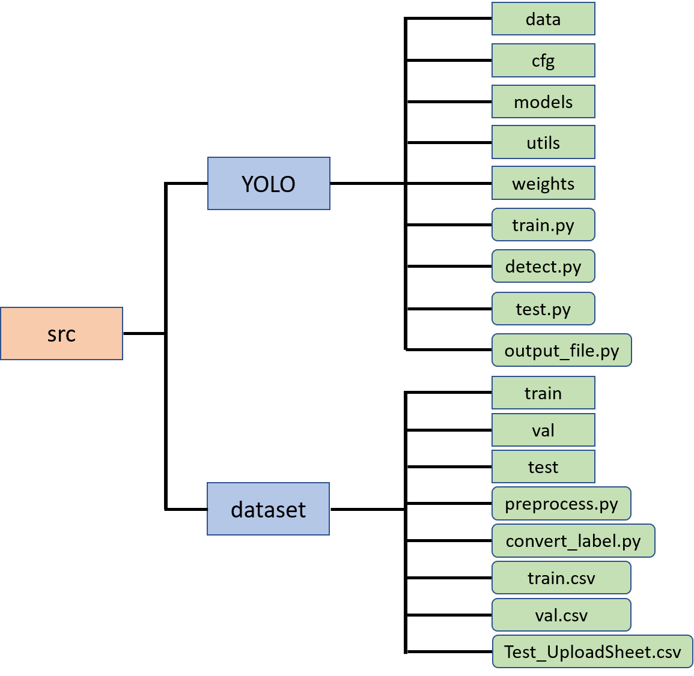
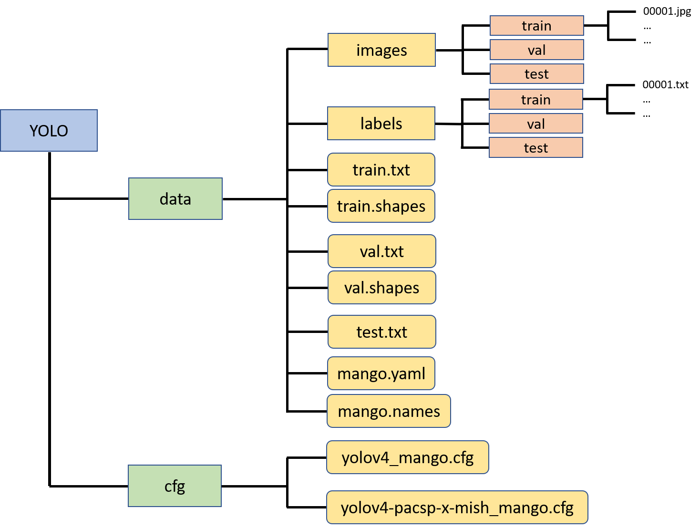

# Mango Defects Classification Competition
This task is to detect or classify whether there is any kind of defects in the mango images.


## Requirements
+ Install through ```requirements.txt```
  ```
  $ pip install -r requirements.txt
  ```
+ You may need to install Mish-cuda from: https://github.com/thomasbrandon/mish-cuda
  ```
  $ git clone https://github.com/thomasbrandon/mish-cuda.git
  $ cd mish-cuda
  $ python setup.py build install
  ```

## Folder Structure


## Preprocess data into YOLO format
+ Process the image data into the format of YOLO and put them into certain folders.
  
  1. Put images into ```data/images/```.
  2. Put the label files (txt files) into ```data/labels/```.
  3. Put ```*.txt``` files and ```*.shapes``` files that represents the image paths and image sizes into ```data/```.
  4. Put ```mango.yaml``` and ```mango.names``` under ```data/```.

## Preprocessing
  In [preprocess.py](./dataset/preprocess.py), you may use it with [convert_label.py](./dataset/convert_label.py).

## Configuration
  Setup custom configuration file in ```cfg``` folder.
  
  + Find out the previous [convolutional] section of each [yolo] section，change the value of the last filter to (num of classes + 5) * 3, (5+5)*3=30 in this task.
  + Set the value of classes in [yolo] section to the number of classes.

## Training
  + The hyper-parameters are the same as the original yolo settings.

    1. ```--weights```: path to pretrained model weights
    2. ```--cfg```: path to cfg file
    3. ```--data```: path to data
    4. ```--epochs```: number of epochs
    5. ```--batch-size```: batch size
    6. ```--img-size```: image size
    7. ```--name```: the name for saving model
    8. ```--device```: GPU number
  
  + command
    ```
    $ python train.py --weights ./weights/yolov4.weights --cfg cfg/yolov4_mango.cfg --data data/mango.yaml --epochs 100 --batch-size 16 --img-size 512 512 --name yolov4 --device 0
    ```
    - If OOM, increase the value of subdivision in cfg or decrease img size.
  
## Inferenceing
  + The hyper-parameters are the same as the original yolo settings.

    1. ```--weights```: path to trained model
    2. ```--source```: path to the folder of images for inferencing
    3. ```--output```: the path for output image folder
    4. ```--img-size```: image size
    5. ```--conf-thres```: the threshold for using the results
    6. ```--device```: GPU no.
    7. ```--cfg```: cfg file path
    8. ```--names```: names file path
  
  + 指令
    ```
    $  python detect.py --weights runs/exp1_yolov4/weights/last_yolov4.pt --source data/images/test/ --output output/ --img-size 512 --conf-thres 0.1 --device 0 --cfg cfg/yolov4_mango.cfg --names data/mango.names
    ```
    After the inferencing, there will be a file named test.csv that saves the prediction results, and the images that contain the defect bounding boxes.

  ## Reference
  The YOLOv4 code is from https://github.com/WongKinYiu/PyTorch_YOLOv4.
