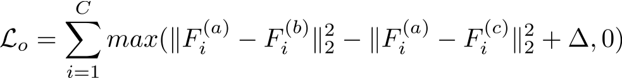
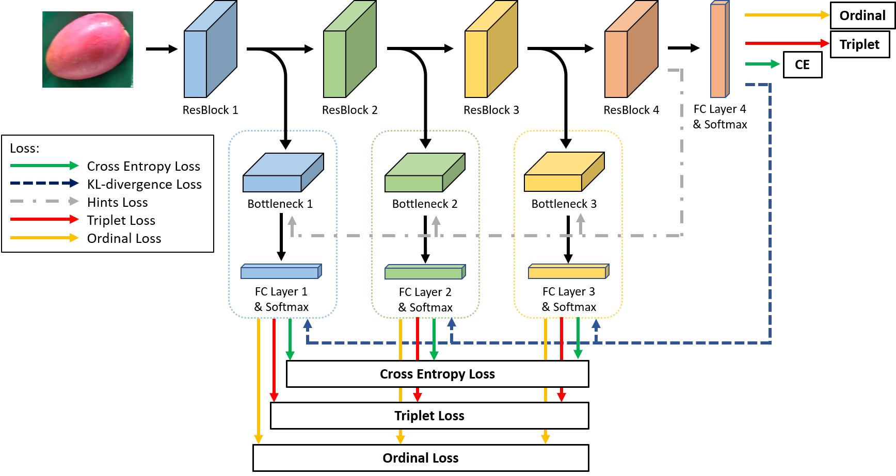

# Mango Grade Classification using Self-Distillation Framework
This task is to classify a given mango image into 3 grade that represent its quality.

We apply the self distillation framework[1] to this dataset and additionally use 2 kind of losses to boost the performance - triplet loss and ordinal loss.

+ Ordinal Loss:
    
    Because the label A and C are the best and the worst quality, the distance between the features from them should be larger than any other relationships. So we want to increase the distance between A and C.
    

+ Architecture:


## Environment Setting
+ PyTorch
```
$ pip install -r requirements.txt
```
## Training
```
$ python train.py --data-path ./dataset/crop/ --network resnet18 --scratch --epoch 150 --batchsize 256 --lr 0.01 --save-path ./trained_models/ 
```
## Inferencing
```
$ python inference.py --network resnet18 --inference --load-path ./trained_models/test/
```

## Reference
[1] L. Zhang, J. Song, A. Gao, J. Chen, C.Bao, and K. Ma. Be your Own Teacher: Improve the performance of convolutional neural networks via self distillation. In proceeding of International Conference on Computer Vision, 2019.

Original code of framework  is from https://github.com/ArchipLab-LinfengZhang/pytorch-self-distillation-final.

Code of Triplet loss is from https://github.com/NegatioN/OnlineMiningTripletLoss.